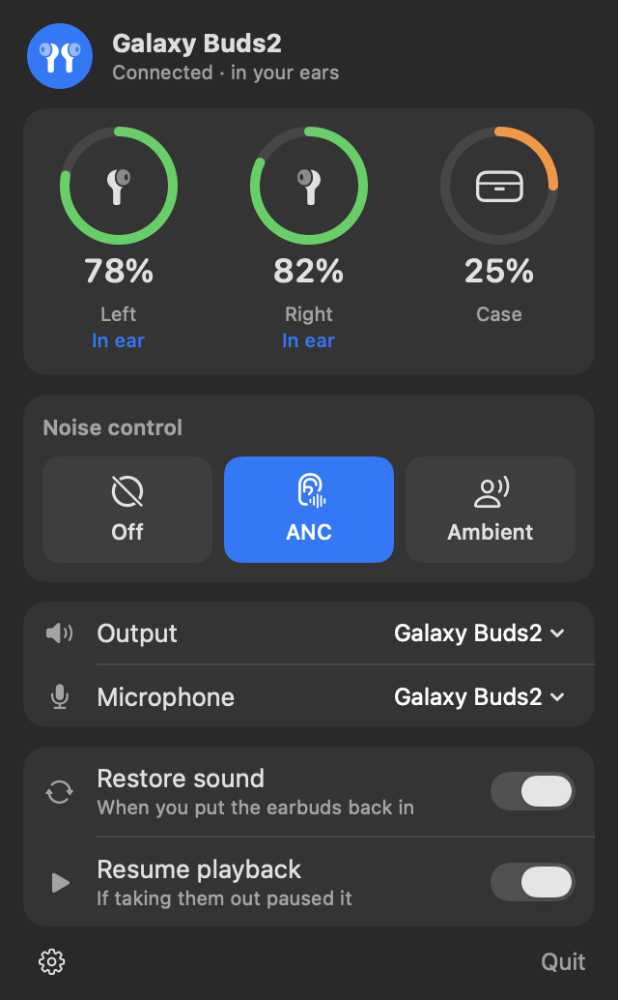

# BudsBar

A small macOS menu-bar app for Samsung Galaxy Buds: battery of each earbud and of the case next
to the clock, noise control, quick output/microphone switching — and a fix for the silence you
get after taking the earbuds out and putting them back in.

<p align="center"></p>

> Unofficial. Not affiliated with or endorsed by Samsung. "Galaxy Buds" is a trademark of
> Samsung Electronics.

## What it does

- **Battery in the menu bar** — the earbuds' average charge and the case's, next to the clock.
  The panel shows left, right and case separately, and whether each earbud is in your ear, out,
  or charging.
- **Noise control** — off, noise cancelling, ambient sound.
- **Output and microphone** — pick the Mac's sound output and input from the same panel.
- **Restores the sound automatically** when you put the earbuds back in (see below).
- **Resumes playback** — the Buds pause your music when you take them out and never restart it;
  BudsBar presses play when they go back in (only if it was the Buds that paused it).
- Launch at login. No telemetry, no network access, no dependencies.

## The silence after taking them out

If an app is holding the earbuds' microphone (a call, or a chat app that simply keeps it open),
macOS runs the Buds in call mode. Leave them out of your ears for 20–30 seconds and the Buds drop
that link; when you put them back, macOS never sets it up again. Bluetooth still says
"connected", the Buds are still the selected output, and you hear nothing until you disconnect
and reconnect them by hand.

BudsBar watches for exactly that state — the call link gone while an app is still recording from
the Buds — and, as soon as the Buds report being worn again, moves the microphone to the Mac's
built-in one for a few seconds and back. That makes macOS re-establish the link; the sound
returns on its own in about five seconds. Nothing is touched when you are simply listening to
music.

## Install

Requires macOS 13 or later and the Xcode command-line tools (`xcode-select --install`).

```sh
git clone https://github.com/pierregaboriaud/budsbar.git
cd budsbar
./scripts/install.sh
```

This builds `BudsBar.app`, copies it to `/Applications` and starts it. macOS asks once for
Bluetooth access, which is how the app talks to the earbuds. Pair and connect the Buds in
Bluetooth settings as usual; BudsBar finds them by itself.

Only one app at a time can use the earbuds' control channel. Quit other Galaxy Buds apps first —
and if the panel says battery levels are unavailable, disconnect and reconnect the earbuds in
Bluetooth once: another app left its connection open inside macOS.

## Supported earbuds

Developed and tested on **Galaxy Buds2**. Buds+ and later speak the same protocol and should
work, but are untested; the original 2019 Galaxy Buds use an older framing and are not supported.
Reports from other models are welcome.

## Development

```sh
swift test                      # protocol and status parsing
./scripts/build-app.sh          # build/BudsBar.app
build/BudsBar.app/Contents/MacOS/BudsBar --snapshot panel.png   # draw the panel with sample data
```

- `Sources/BudsKit` — protocol framing and status parsing, CoreAudio helpers, the call-link
  recovery, playback resume. No UI.
- `Sources/BudsBar` — the app: Bluetooth control channel (`IOBluetooth` RFCOMM), menu-bar item,
  SwiftUI panel.

The log is `~/Library/Logs/BudsBar.log`.
`defaults write io.github.pierregaboriaud.BudsBar debug -bool YES` adds every frame exchanged
with the earbuds.

macOS ties the Bluetooth permission to the app's code signature. `build-app.sh` signs with an
"Apple Development" certificate when there is one in the keychain (or `CODESIGN_IDENTITY`), and
ad hoc otherwise — in which case macOS asks for Bluetooth access again after each rebuild.

Two things have no public API and are done the only way available: the state of the call link
and the earbuds' pause commands are read from the Bluetooth daemon's log (`log stream`), and the
play command goes through the private MediaRemote framework.

## Acknowledgements

- [GalaxyBudsClient](https://github.com/timschneeb/GalaxyBudsClient) documented the earbuds'
  control protocol.
- [galaxy-buds-mac](https://github.com/vedatkilic/galaxy-buds-mac) (MIT) showed how to reach that
  protocol from macOS; BudsBar's message layout follows it.
- [Fader](https://github.com/pantafive/fader) (MIT) inspired the device switching.

## License

[MIT](LICENSE)
